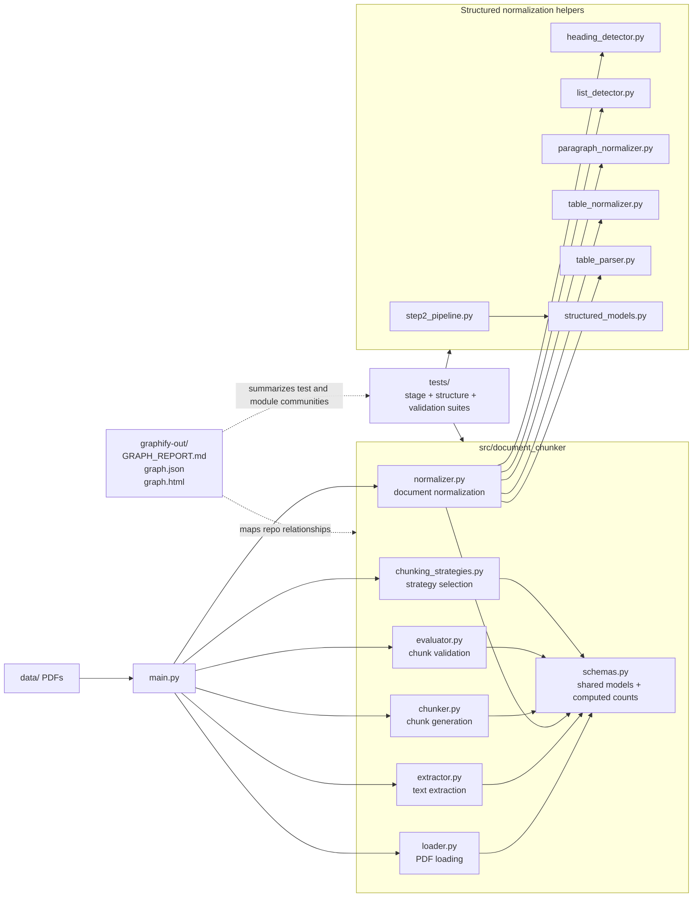
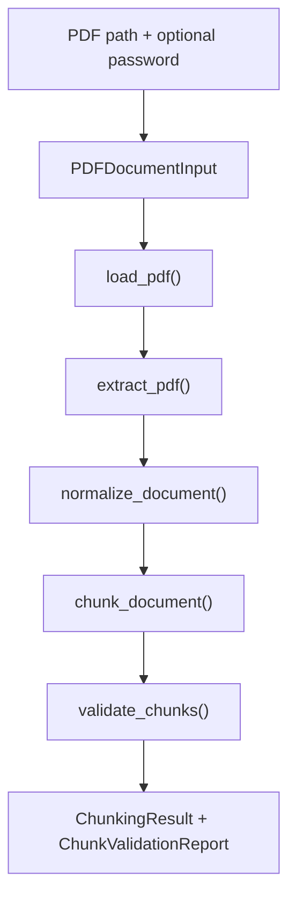

# `Document Chunker`

`document-chunker` is a PDF processing pipeline that takes a local PDF through validation, loading, extraction, normalization, chunking, and chunk validation. The repo is organized as small, testable modules with explicit schema boundaries, and the generated graph artifacts in `graphify-out/` make those runtime and test relationships easy to inspect.

This is not just "text extraction" anymore. The current codebase includes:

- input validation with `PDFDocumentInput`
- PDF loading and decryption checks
- page-by-page text extraction
- layout-aware normalization into paragraphs, lists, headings, and tables
- multiple chunking strategies
- invariant-based chunk validation
- generated graph reports for codebase inspection

## Architecture

The generated graph in `graphify-out/GRAPH_REPORT.md`, `graphify-out/graph.json`, and `graphify-out/graph.html` currently reports:

- `558` nodes
- `1301` edges
- `22` communities
- no import cycles detected



The graph's highest-connectivity nodes are centered on `build_structured_document()`, `chunk_document()`, `validate_chunks()`, `normalize_page()`, and `extract_pdf()`, which matches the codebase's real center of gravity: normalization, chunking, validation, and their surrounding schemas/tests.

## Pipeline

The runtime flow exercised by `main.py` is:



## What Each Stage Does

**Validate**  
`PDFDocumentInput` rejects empty paths, missing files, non-files, non-`.pdf` inputs, and zero-byte files before any PDF work starts.

**Load**  
`load_pdf()` opens the file with `pypdf`, handles encrypted PDFs, and raises `PDFLoadError` for corrupted files, unreadable content, bad passwords, or empty page sets.

**Extract**  
`extract_pdf()` builds extracted document/page models from `pypdf` output. Blank pages are preserved, and the document is rejected only when the extracted result is effectively empty.

**Normalize**  
`normalize_document()` reconstructs cleaner text from layout-preserving extraction. It repairs wrapped lines and rebuilds page-level blocks such as headings, paragraphs, lists, and tables.

**Chunk**  
`chunk_document()` converts normalized content into `DocumentChunk` objects. The repo currently supports:

- `v1.0`: character chunking with overlap
- `v2.1`: structural chunking with no context carry
- `v2.2`: structural chunking with context carry

`main.py` currently runs `v2.2` by default.

**Validate Chunks**  
`validate_chunks()` checks invariants such as order preservation, max-size rules, overlap behavior, non-whitespace coverage, traceability, offsets, structural integrity, and atomic element coverage.

## Repository Layout

```text
main.py
src/document_chunker/
  chunker.py
  chunking_strategies.py
  counting.py
  evaluator.py
  extractor.py
  heading_detector.py
  list_detector.py
  loader.py
  normalizer.py
  paragraph_normalizer.py
  schemas.py
  step2_pipeline.py
  structured_models.py
  table_normalizer.py
  table_parser.py
tests/
graphify-out/
data/
```

At a high level:

- `schemas.py` defines the shared Pydantic models and computed counts
- `loader.py`, `extractor.py`, and `normalizer.py` implement the core document pipeline
- `chunker.py` and `chunking_strategies.py` implement chunk creation and strategy selection
- `evaluator.py` validates chunk correctness with explicit invariants
- `heading_detector.py`, `list_detector.py`, `paragraph_normalizer.py`, `table_normalizer.py`, and `table_parser.py` support structured normalization
- `structured_models.py` contains a parallel structured-document model set for the Step 2 redesign work

## Running It

```bash
uv run main.py [path/to/file.pdf] [password]
```

If no arguments are provided, `main.py` defaults to `data/BAWSE.pdf`.

The runner currently:

- validates the input
- loads and extracts the PDF
- normalizes the document
- chunks it using the active strategy
- prints chunk ranges and sample chunk contents
- validates the chunk output and exits non-zero on invariant failures

## Chunking Strategy Snapshot

The README previously described chunking as future work. That is stale. The repo already contains working chunking and validation, plus a comparison summary derived from the current normalization/chunking pipeline:

| Strategy | Source chars | Chunks | Chunk size | Overlap | Stride | Total chunk chars | Duplicate chars | Duplicate overhead % |
|---|---:|---:|---:|---:|---:|---:|---:|---:|
| Character chunking with overlap (`v1.0`) | 7,579 | 9 | 1000 | 100 | 900 | 8,379 | 800 | 10.56% |
| Structural chunking, no context carry (`v2.1`) | 7,576 | 8 | 1000 | 0 | 1000 | 7,567 | -9 | -0.12% |
| Structural chunking, context carry (`v2.2`) | 7,576 | 8 | 1000 | 0 | 1000 | 7,568 | -8 | -0.11% |

Those figures reflect the current sample comparison captured in the existing README/report context, where structural strategies slightly reduce duplicated storage overhead compared with fixed overlapping chunks.

## Tests

The graph report and test tree show coverage across the pipeline and its structural helpers, including:

- `test_loader.py`
- `test_extractor.py`
- `test_normalizer.py`
- `test_normalizer_validation.py`
- `test_chunker.py`
- `test_evaluator.py`
- `test_heading_detector.py`
- `test_list_detector.py`
- `test_paragraph_normalizer.py`
- `test_table_normalizer.py`
- `test_table_parser.py`
- `test_structured_models.py`

The test suite is no longer just stage-by-stage smoke coverage. It also exercises structural reconstruction, table behavior, span invariants, and chunk/evaluator correctness.

## Graph Artifacts

`graphify-out/` contains three useful outputs:

- `GRAPH_REPORT.md`: human-readable graph summary, community hubs, "god nodes", and graph freshness metadata
- `graph.json`: raw node/edge/community data for downstream tooling
- `graph.html`: interactive graph viewer

The HTML viewer includes:

- searchable nodes
- clickable node inspection
- neighbor browsing
- community legend/filtering
- graph statistics in the sidebar

Regenerate the graph with:

```bash
graphify update .
```

The current report was generated on `2026-08-11` and records commit `805f251a` as its source snapshot.
