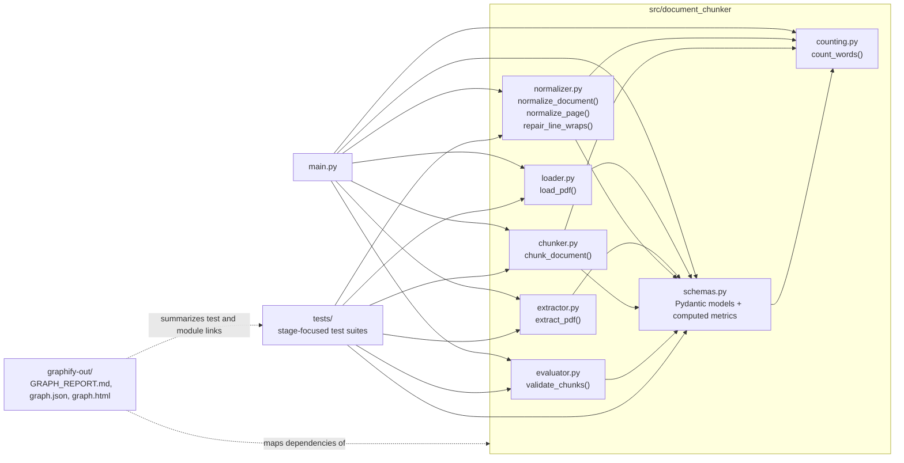
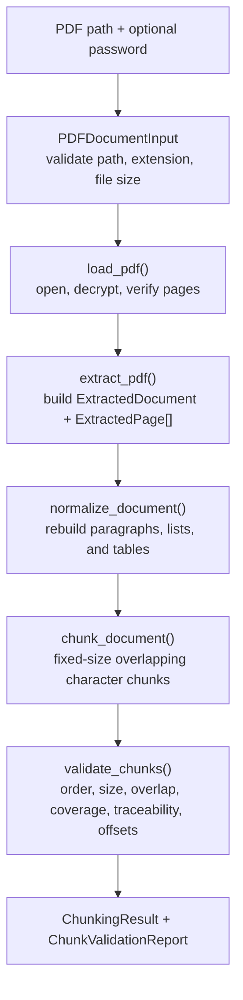

# `document-chunker`

A PDF-in, clean-text-out pipeline I'm building step by step: validate the file, load it, pull the text out, then repair whatever the PDF extractor mangled on the way. Each stage is its own module with its own tests, and each one only trusts what the stage before it actually guarantees — nothing gets assumed for free.

The end goal (hence the name) is chunking: turning a normalized document into retrieval-sized pieces. That stage doesn't exist yet — right now the pipeline stops after normalization, and `main.py` is a scratch runner for exercising the pipeline end to end, not a finished CLI.

## Architecture

The graph in `graphify-out/GRAPH_REPORT.md`, `graphify-out/graph.json`, and `graphify-out/graph.html` shows the project organized around shared schemas, a linear processing pipeline, and a separate validation layer around chunking. The diagram below compresses that generated graph into the core runtime relationships.



## Pipeline

This is the runtime document-processing path reflected in `main.py` and reinforced by the graph communities around `PDFDocumentInput`, `normalize_document`, `ChunkingConfig`, and `validate_chunks`.



**Validate** — `PDFDocumentInput` (in `schemas.py`) is the gate everything else trusts. Before any PDF gets opened, pydantic checks the path is non-empty, exists, is an actual file, ends in `.pdf`, and isn't zero bytes.

**Load** — `load_pdf()` (`loader.py`) opens the file with `pypdf`, decrypts it if needed, and confirms it actually has pages. Corrupted files, unsupported encryption, wrong passwords, and empty PDFs all fail here as `PDFLoadError` instead of surfacing as a confusing crash later.

**Extract** — `extract_pdf()` (`extractor.py`) pulls text out page by page using pypdf's layout-aware extraction mode (`extraction_mode="layout"`), which keeps columns and spacing closer to how the page actually looks instead of dumping raw content-stream order. Every page becomes an `ExtractedPage`, blank pages are kept (not dropped), and the whole document is only rejected if *every* page comes back empty. This stage deliberately does no cleanup — it's a faithful record of what pypdf handed back, so bugs in later stages are never confused with extraction bugs.

**Normalize** — `normalize_document()` (`normalizer.py`) is where the real work happens. Layout extraction is good at preserving structure but bad about soft-wrapping lines mid-sentence, so this stage classifies each line (heading, list item, table row, or plain text) and rebuilds paragraphs, lists, and tables from those pieces — rejoining lines that were only wrapped because the page ran out of width, while leaving genuine paragraph and list boundaries alone. It runs page-by-page so a layout quirk on one page can't bleed into the next, then recombines everything into a `NormalizedDocument` with both clean full text and a block-level structure (`NormalizedBlock`s: heading/paragraph/list/table) for anything downstream that wants structure instead of a text blob.

Word and character counts are computed fields on the schemas themselves (via `count_words()` in `counting.py`), not hand-maintained — so a page's `word_count` can never drift from its `text`.

## Layout

```
main.py                          # scratch runner: exercises the full pipeline against a sample PDF
src/document_chunker/
  schemas.py                     # PDFDocumentInput, Extracted*/Normalized* models
  loader.py                      # load_pdf(), PDFLoadError
  extractor.py                   # extract_pdf(), PDFExtractionError
  normalizer.py                  # normalize_document(), line classification + block building
  counting.py                    # count_words()
tests/                           # one test file per pipeline stage, plus shared fixtures in conftest.py
data/                            # sample PDFs used by main.py and the tests (invoice, receipt, resume, etc.)
graphify-out/                    # generated codebase graph (GRAPH_REPORT.md, graph.json, graph.html)
```

## Running it

```
uv run main.py [path/to/file.pdf] [password]
```

Defaults to `data/sample.pdf` with no password if no arguments are given. It walks through validate → load → extract → normalize and prints the word/char counts at each stage so you can see what each step actually changed.

## Strategy Comparison

Chunking runs against `normalized_text`, not the structured blocks — the point is to have a baseline that later strategies (structure-aware, semantic, etc.) can be measured against on the exact same normalized input. Metrics below are computed on `data/sample.pdf` using the per-strategy configs shown in the table.

- **Chunk size / Overlap / Stride** — the configured `max_chunk_size` / `overlap_size`, and the derived step between chunk starts (`stride = chunk_size - overlap`).
- **Total chunk characters** — sum of every chunk's `char_count` (`ChunkingResult.total_char_count`). Overlapping regions get counted once per chunk that contains them, so this is normally >= source characters for overlap-based chunking, but can be slightly lower for structural chunking if boundary-only whitespace is omitted.
- **Duplicate characters** — `total_chunk_characters − source_characters`: the excess from characters that appear in more than one chunk because of overlap. Structural chunking can make this negative when it drops boundary-only whitespace instead of duplicating it.
- **Duplicate overhead %** — `duplicate_characters / source_characters × 100`: how much extra text (and therefore extra embeddings/storage) the overlap costs relative to the source.

| Strategy | Source chars | Chunks | Chunk size | Overlap | Stride | Total chunk chars | Duplicate chars | Duplicate overhead % |
|---|---|---|---|---|---|---|---|---|
| Character (fixed-size, overlap) (max_chunks_size=1000, overlap_size (step_size)=100)| 7,579 | 9 | 1000 | 100 | 900 | 8,379 | 800 | 10.56% |
| Structural v2.1 (no context carry) | 7,576 | 8 | 1000 | 0 | 1000 | 7,567 | NA | NA |
| Structural v2.2 (with context carry) | 7,576 | 8 | 1000 | 0 | 1000 | 7,568 | -8 | -0.11% |

## Tests

Each pipeline stage has its own test file (`test_loader.py`, `test_extractor.py`, `test_normalizer.py`), covering both the happy path and the edge cases that motivated each design decision — encrypted/corrupted/empty PDFs, blank-page handling, idempotent normalization, table and list edge cases, etc. `conftest.py` holds the shared fixtures, including a real-PDF builder (`create_pdf`) and a fake `PdfReader` for testing extraction logic without touching disk.

## Exploring the codebase

`graphify-out/` has a generated dependency/call graph of this repo (`GRAPH_REPORT.md` for a readable summary, `graph.html` to browse it, `graph.json` for the raw data) — useful for seeing how the pieces connect without reading every file. Regenerate it with `graphify update .` after making changes; it's cheap since it only re-analyzes what changed.
