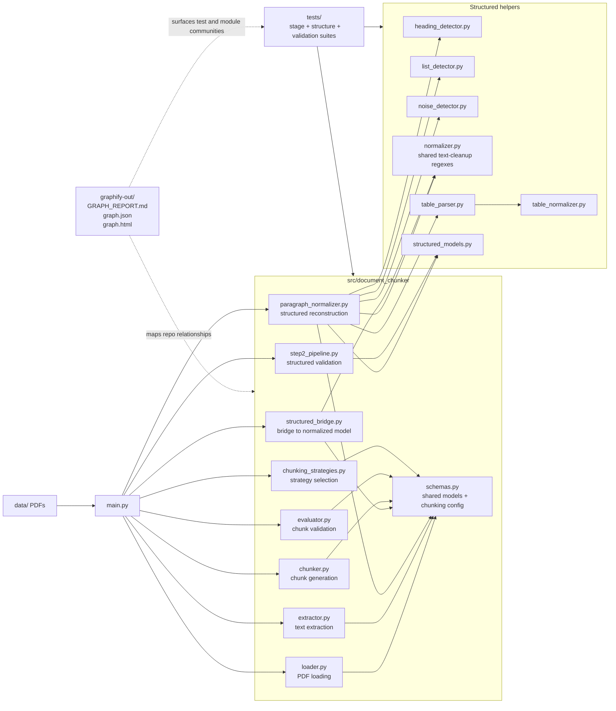
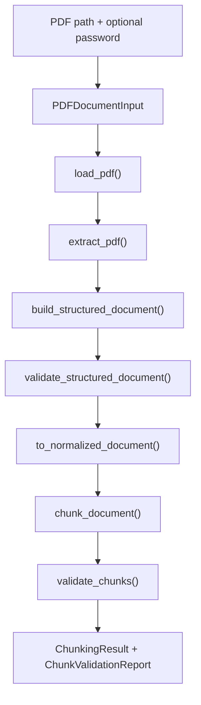

# `Document Chunker`

`document-chunker` is a PDF processing pipeline that takes a local PDF through validation, loading, extraction, structured reconstruction, normalization, chunking, and chunk validation. The repo is still organized around small, testable stages with explicit schema boundaries, and the generated graph artifacts in `graphify-out/` make the runtime and test relationships easy to inspect.

This is not just "text extraction" anymore. The current codebase includes:

- input validation with `PDFDocumentInput`
- PDF loading and decryption checks
- page-by-page text extraction
- structured reconstruction into headings, paragraphs, lists, and tables
- noise detection for repeated headers, footers, and page numbers
- a bridge back into the normalized document model used for chunking
- multiple chunking strategies
- invariant-based chunk validation
- chunk quality evaluation and cross-strategy comparison tooling
- generated graph reports for codebase inspection

## Install / Setup

Requirements:

- Python `>=3.14`
- [`uv`](https://docs.astral.sh/uv/) for dependency management and running scripts

```bash
git clone https://github.com/E-techgod/document-chunker
cd document-chunker
uv sync
```

`uv sync` creates a `.venv`, installs the pinned dependencies from `uv.lock` (`pydantic`, `pypdf`, `pytest`, plus the `black`/`ruff` dev group, included by default), and installs `document-chunker` itself in editable mode. That editable install registers two console scripts (defined in `pyproject.toml`) that `uv run` can invoke from anywhere in the repo:

```bash
uv run chunk [path/to/file.pdf] [password] 
uv run compare-strategies [path/to/file.pdf] [password]

# Using installed CLI
chunk <path/to/file.pdf> [password]

# Using uv
uv run chunk <path/to/file.pdf> [password]
```

Both default to `data/BAWSE.pdf` when no path is given. See [Running It](#running-it) and [Comparing Chunking Strategies](#comparing-chunking-strategies) below for what each command does.

## Architecture

The generated graph in `graphify-out/GRAPH_REPORT.md`, `graphify-out/graph.json`, and `graphify-out/graph.html` currently reports:

- `699` nodes
- `1955` edges
- `60` communities
- no import cycles detected



The graph's highest-connectivity nodes are centered on `build_structured_document()`, `chunk_document()`, `validate_chunks()`, `normalize_page()`, and `extract_pdf()`, which matches the codebase's real center of gravity: reconstructing document structure cleanly enough that chunking and validation remain trustworthy.

## Pipeline

The runtime flow exercised by `main.py` is:



## What Each Stage Does

**Validate**  
`PDFDocumentInput` rejects empty paths, missing files, non-files, non-`.pdf` inputs, and zero-byte files before any PDF work starts.

**Load**  
`load_pdf()` opens the file with `pypdf`, handles encrypted PDFs, and raises `PDFLoadError` for corrupted files, unreadable content, bad passwords, or empty page sets.

**Extract**  
`extract_pdf()` builds extracted document/page models from `pypdf` output. Blank pages are preserved, and the document is rejected only when the extracted result is effectively empty.

**Reconstruct Structure**  
`build_structured_document()` rebuilds cleaner document structure from extracted page text, classifying headings, paragraphs, lists, tables, and noise. The helper modules around it are where most of the layout-sensitive work now lives.

**Validate Structured Output**  
`validate_structured_document()` checks Step 2 invariants against the extracted source. `main.py` treats those findings as warnings rather than fatal errors because some known edge cases are documented limitations, not pipeline breakages.

**Bridge to the Chunking Model**  
`to_normalized_document()` converts the structured representation back into the normalized document shape expected by the chunker and evaluator.

**Chunk**  
`chunk_document()` converts normalized content into `DocumentChunk` objects. The repo currently supports:

- `v1.0`: character chunking with overlap
- `v2.1`: structural chunking with no context carry
- `v2.2`: structural chunking with context carry

`main.py` currently runs `v2.2` by default.

**Validate Chunks**  
`validate_chunks()` checks invariants such as order preservation, max-size rules, overlap behavior, non-whitespace coverage, traceability, offsets, structural integrity, and atomic element coverage.

## Repository Shape

```text
src/document_chunker/
  main.py
  compare_strategies.py
  chunker.py
  chunking_strategies.py
  counting.py
  evaluator.py
  extractor.py
  heading_detector.py
  list_detector.py
  loader.py
  noise_detector.py
  normalizer.py
  paragraph_normalizer.py
  quality.py
  schemas.py
  step2_pipeline.py
  structured_bridge.py
  structured_models.py
  table_normalizer.py
  table_parser.py
tests/
graphify-out/
data/
```

At a high level:

- the core story is still validate -> extract -> reconstruct -> chunk -> verify
- the repo now has a real structured-document layer, not just flattened normalized text
- the tests are split across stage behavior, structural reconstruction, and invariant enforcement

## Running It

```bash
uv run chunk [path/to/file.pdf] [password]
```

If no arguments are provided, `main.py` defaults to `data/BAWSE.pdf`.

The runner currently:

- validates the input
- loads and extracts the PDF
- builds and checks the structured document
- bridges that structure into the normalized chunking model
- chunks with the active strategy
- prints chunk ranges and sample chunk contents
- validates the chunk output and exits non-zero on chunk invariant failures

## Comparing Chunking Strategies

`compare_strategies.py` runs the same document through all three chunking strategies (`v1.0`, `v2.1`, `v2.2`) and prints a side-by-side quality comparison built on `evaluate_chunk_quality()`:

```bash
uv run compare-strategies [path/to/file.pdf] [password]
```

If no arguments are provided, it defaults to `data/BAWSE.pdf`. Example output:

```text
Chunk quality comparison for data/BAWSE.pdf

Metric                V1      V2.1      V2.2   
------------------------------------------------
Valid                 ✓         ✓         ✓     
Chunks                37        37        37    
Avg utilization      99%       89%       89%    
Tiny chunks           0%        0%        0%    
Word splits           14        0         0     
Bullet splits         41        0         0     
Table-row splits      9         0         0     
Context overhead     10%*       0%        2%    
Context coverage     N/A       N/A       97%    
* overlap redundancy from character-based chunking, not injected context
```

`v2.2` (structural chunking with context carry) is the only strategy that avoids splitting words, bullets, and table rows while still tracking near-complete context coverage — the tradeoff for `v1.0`'s higher raw utilization is the loss of structural integrity.

## Tests

The graph report and current test tree show coverage across the pipeline and its structural helpers, including:

- `test_loader.py`
- `test_extractor.py`
- `test_normalizer.py`
- `test_normalizer_validation.py`
- `test_chunker.py`
- `test_evaluator.py`
- `test_heading_detector.py`
- `test_list_detector.py`
- `test_noise_detector.py`
- `test_paragraph_normalizer.py`
- `test_table_normalizer.py`
- `test_table_parser.py`
- `test_structured_bridge.py`
- `test_structured_models.py`
- `test_quality.py`

The suite is not just stage-by-stage smoke coverage. It also exercises structural reconstruction, heading/list heuristics, noise detection, table behavior, bridging, and chunk/evaluator invariants.

## Graph Artifacts

`graphify-out/` contains three useful outputs:

- `GRAPH_REPORT.md`: human-readable graph summary, community hubs, "god nodes", and graph freshness metadata
- `graph.json`: raw node/edge/community data for downstream tooling
- `graph.html`: interactive graph viewer

The HTML viewer includes:

- searchable nodes
- clickable node inspection
- neighbor browsing
- community legend/filtering
- graph statistics in the sidebar

Regenerate the graph with:

```bash
graphify update .
```

The current report was generated on `2026-08-12` and records commit `96ffac05` as its source snapshot.
